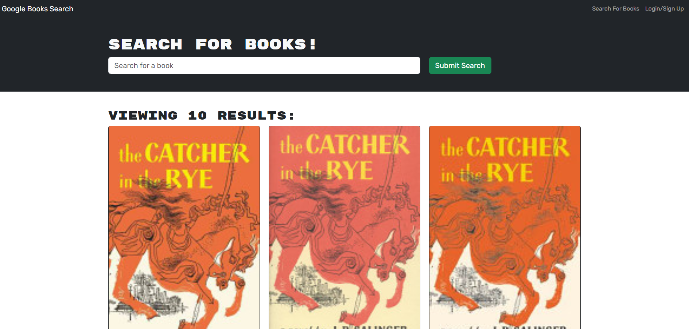

# Book-Search

## Description

The Book Search app is a quick tool that runs a search for whatever book you can think of. It can easily find any book and information you need on said book in a matter of moments, and streamlines saving books that you want to remember or for whatever purpose you have in mind. Using the MERN techniques that we learned for this project to further my knowledge and complete the last assignment was useful for my experience. It was definitely the biggest project I've worked on and it was satisfying to see the end result. I picked up some useful information during this assignment for the future. Running into problems with deployment again, not sure how to solve those issues this time around, even with the assistance I had.

## Table of Contents (Optional)

N/A

## Installation

N/A

## Usage

[Link to App](https://ancient-ridge-13402-b82d9d4ddb44.herokuapp.com/)

## Credits

Class material, tutor help from Sam Cordova, and TA help from Nathan Hedglin
